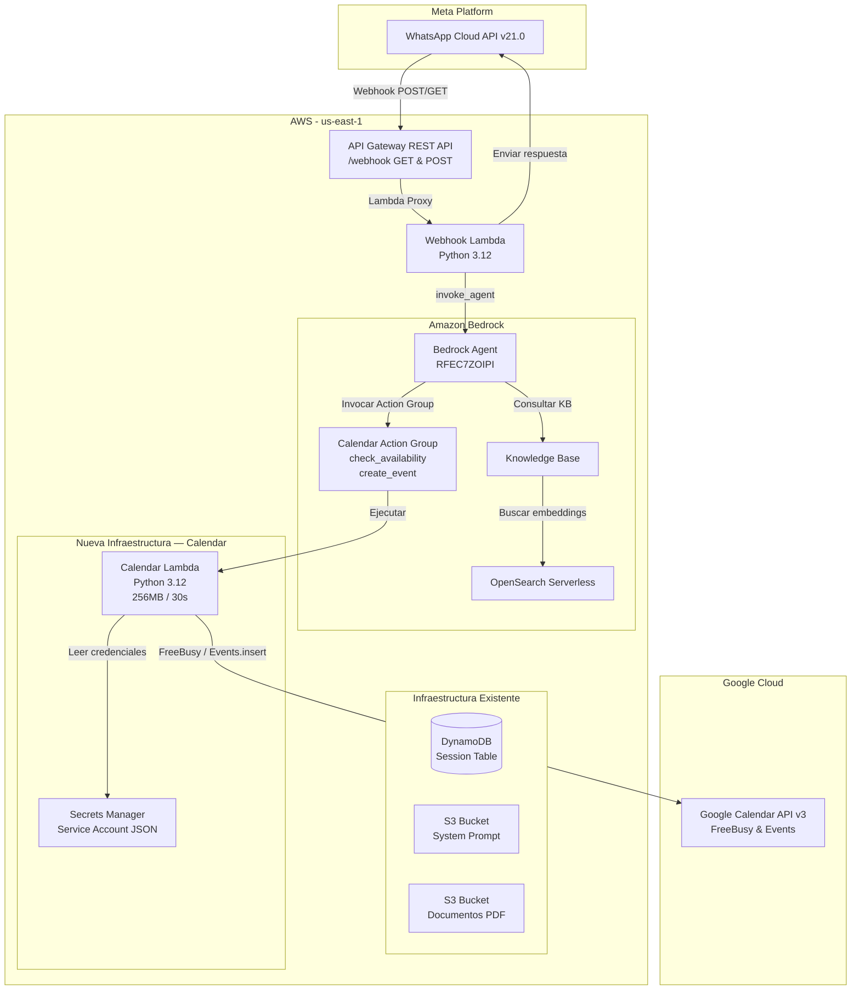
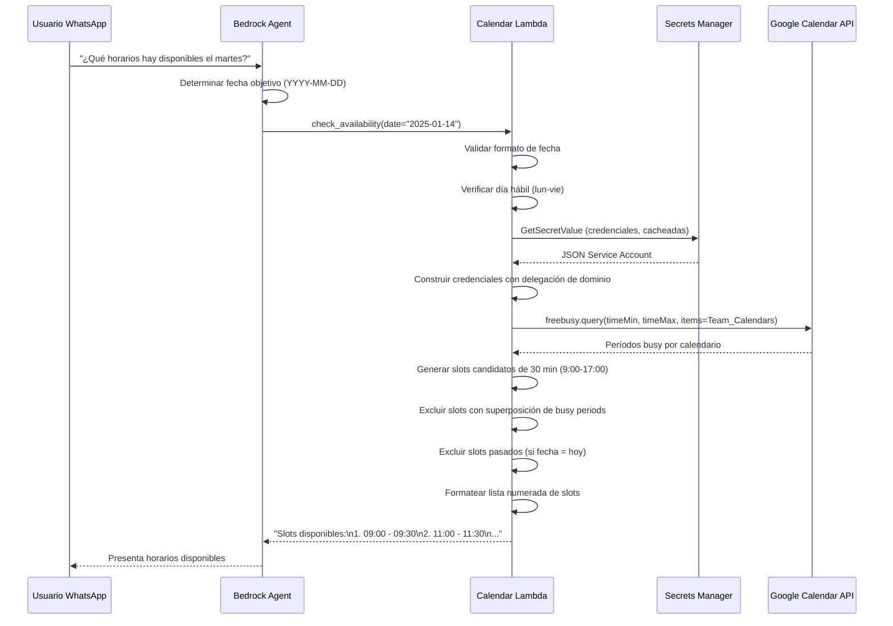
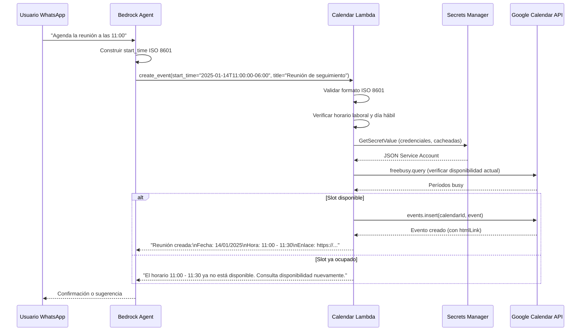

# Documento de Diseño — Google Calendar Scheduling (Action Group)

## Resumen

Este documento describe el diseño técnico de un Action Group para el Bedrock Agent existente (ID: RFEC7ZOIPI) del sistema WABA Bedrock Webhook, que permite consultar disponibilidad en múltiples calendarios de Google Workspace y crear reuniones de 30 minutos. La integración se realiza mediante una nueva función Lambda (`Calendar_Lambda`) que se comunica con la Google Calendar API v3 usando una cuenta de servicio con delegación a nivel de dominio. Las credenciales se almacenan en AWS Secrets Manager y se cachean en memoria durante la vida de la instancia Lambda. La infraestructura se extiende sobre el CDK Stack existente (`WabaBedrockStack`).

### Decisiones de Diseño Clave

1. **Lambda separada para el Action Group**: Se usa una Lambda independiente (`lambda-calendar/`) en lugar de extender la Lambda del webhook existente, para mantener separación de responsabilidades, dependencias independientes (`google-auth`, `google-api-python-client`) y ciclos de despliegue desacoplados.
2. **FreeBusy API en lugar de Events.list**: Se usa el endpoint `freebusy.query` de Google Calendar API para consultar disponibilidad de múltiples calendarios en una sola solicitud, en lugar de listar eventos individuales de cada calendario. Esto es más eficiente y respeta la privacidad (no expone detalles de eventos).
3. **Cuenta de servicio con delegación de dominio**: Permite acceder a los calendarios del equipo sin requerir consentimiento OAuth individual de cada usuario. La cuenta de servicio impersona a un usuario del dominio para realizar las llamadas a la API.
4. **Credenciales en Secrets Manager**: Las credenciales JSON de la cuenta de servicio se almacenan en Secrets Manager (no en variables de entorno) para mayor seguridad. Se cachean en memoria durante warm starts para evitar llamadas repetidas.
5. **Esquema OpenAPI inline en CDK**: El esquema del Action Group se define como OpenAPI 3.0.0 inline en el CDK Stack usando `CfnAgentActionGroup`, evitando la necesidad de un bucket S3 adicional para el esquema.
6. **Validación doble de horarios**: La Lambda valida tanto el formato de los parámetros de entrada como las reglas de negocio (horario laboral, días hábiles, disponibilidad actual) antes de ejecutar operaciones contra Google Calendar.

---

## Arquitectura

### Diagrama de Arquitectura General



### Flujo de Consulta de Disponibilidad



### Flujo de Creación de Evento



---

## Componentes e Interfaces

### 1. Calendar Lambda Handler (`lambda-calendar/handler.py`)

Punto de entrada de la Lambda que procesa las invocaciones del Action Group de Bedrock.

**Responsabilidades:**
- Parsear el evento de invocación del Action Group de Bedrock
- Enrutar a la acción correspondiente (`check_availability` o `create_event`)
- Validar parámetros de entrada
- Construir la respuesta en el formato esperado por Bedrock Agent

**Interfaz:**
```python
def lambda_handler(event: dict, context) -> dict:
    """
    Handler principal de la Calendar Lambda.

    Procesa invocaciones del Bedrock Agent Action Group.

    Args:
        event: Evento de invocación del Action Group con estructura:
            {
                "actionGroup": str,
                "apiPath": str,
                "httpMethod": str,
                "parameters": list[dict],
                "messageVersion": str
            }
        context: Contexto de ejecución Lambda.

    Returns:
        dict con la respuesta formateada para el Action Group:
        {
            "messageVersion": "1.0",
            "response": {
                "actionGroup": str,
                "apiPath": str,
                "httpMethod": str,
                "responseCode": int,
                "responseBody": {
                    "application/json": {
                        "body": str
                    }
                }
            }
        }
    """
```

**Funciones internas:**
```python
def _parse_parameters(parameters: list[dict]) -> dict:
    """Convierte la lista de parámetros del Action Group a un dict."""

def _build_response(event: dict, status_code: int, body: str) -> dict:
    """Construye la respuesta en formato Action Group de Bedrock."""

def _route_action(api_path: str, parameters: dict) -> tuple[int, str]:
    """Enruta la solicitud a la acción correspondiente y retorna (status_code, body)."""
```

### 2. Módulo de Disponibilidad (`lambda-calendar/availability.py`)

Encapsula la lógica de consulta de disponibilidad y cálculo de slots.

**Interfaz:**
```python
def check_availability(
    date_str: str,
    calendar_service,
    team_calendars: list[str],
    timezone_str: str,
) -> tuple[int, str]:
    """
    Consulta disponibilidad del equipo para una fecha dada.

    Args:
        date_str: Fecha en formato YYYY-MM-DD.
        calendar_service: Instancia autenticada de Google Calendar API service.
        team_calendars: Lista de correos electrónicos del equipo.
        timezone_str: Zona horaria (ej: "America/Mexico_City").

    Returns:
        Tupla (status_code, mensaje_respuesta).
    """

def generate_candidate_slots(
    date: datetime.date,
    timezone_str: str,
) -> list[tuple[datetime, datetime]]:
    """
    Genera slots candidatos de 30 minutos alineados a :00 y :30
    dentro del horario laboral (9:00-17:00).

    Args:
        date: Fecha para generar slots.
        timezone_str: Zona horaria para los límites del horario laboral.

    Returns:
        Lista de tuplas (inicio, fin) como datetimes con timezone.
    """

def filter_available_slots(
    candidate_slots: list[tuple[datetime, datetime]],
    busy_periods: dict[str, list[dict]],
    now: datetime | None = None,
) -> list[tuple[datetime, datetime]]:
    """
    Filtra slots candidatos eliminando los que se superponen con
    períodos busy de cualquier calendario y los que ya pasaron.

    Args:
        candidate_slots: Slots candidatos generados.
        busy_periods: Dict de calendario -> lista de {start, end} busy.
        now: Momento actual (para excluir slots pasados). None = no filtrar.

    Returns:
        Lista de slots disponibles.
    """

def format_slots_response(
    slots: list[tuple[datetime, datetime]],
    timezone_str: str,
) -> str:
    """
    Formatea los slots disponibles como lista numerada legible.

    Args:
        slots: Lista de tuplas (inicio, fin).
        timezone_str: Zona horaria para presentación.

    Returns:
        String con formato "1. 09:00 - 09:30\n2. 11:00 - 11:30\n..."
    """
```

### 3. Módulo de Creación de Eventos (`lambda-calendar/event_creator.py`)

Encapsula la lógica de creación de eventos en Google Calendar.

**Interfaz:**
```python
def create_event(
    start_time_str: str,
    title: str,
    calendar_service,
    team_calendars: list[str],
    timezone_str: str,
) -> tuple[int, str]:
    """
    Crea un evento de 30 minutos en Google Calendar.

    Args:
        start_time_str: Hora de inicio en formato ISO 8601.
        title: Título del evento (1-200 caracteres).
        calendar_service: Instancia autenticada de Google Calendar API service.
        team_calendars: Lista de correos electrónicos del equipo (asistentes).
        timezone_str: Zona horaria configurada.

    Returns:
        Tupla (status_code, mensaje_respuesta).
    """

def build_event_payload(
    start_time: datetime,
    end_time: datetime,
    title: str,
    attendees: list[str],
    timezone_str: str,
) -> dict:
    """
    Construye el payload para events.insert de Google Calendar API.

    Args:
        start_time: Hora de inicio con timezone.
        end_time: Hora de fin con timezone.
        title: Título del evento.
        attendees: Lista de correos de asistentes.
        timezone_str: Zona horaria del evento.

    Returns:
        Dict con la estructura del evento para la API.
    """

def format_event_confirmation(
    event_data: dict,
    timezone_str: str,
) -> str:
    """
    Formatea la confirmación de creación de evento.

    Args:
        event_data: Respuesta de events.insert de Google Calendar API.
        timezone_str: Zona horaria para presentación.

    Returns:
        String con fecha, hora, título y enlace del evento.
    """
```

### 4. Módulo de Autenticación Google (`lambda-calendar/google_auth_helper.py`)

Encapsula la autenticación con Google Calendar API usando cuenta de servicio.

**Interfaz:**
```python
# Instancia global cacheada
_cached_credentials: dict | None = None
_cached_service = None

def get_calendar_service(
    secret_arn: str,
    impersonate_email: str,
) -> Resource:
    """
    Obtiene una instancia autenticada del servicio Google Calendar API.

    Cachea las credenciales en memoria durante la vida de la instancia Lambda.

    Args:
        secret_arn: ARN del secreto en Secrets Manager con el JSON de la cuenta de servicio.
        impersonate_email: Correo del usuario a impersonar para delegación de dominio.

    Returns:
        Instancia de googleapiclient.discovery.Resource para Calendar API v3.

    Raises:
        GoogleAuthError: Si falla la lectura de credenciales o la autenticación.
    """

def _load_credentials_from_secrets_manager(secret_arn: str) -> dict:
    """Lee y parsea el JSON de credenciales desde Secrets Manager."""

def _build_delegated_credentials(
    credentials_info: dict,
    impersonate_email: str,
) -> google.oauth2.service_account.Credentials:
    """Construye credenciales con delegación de dominio."""
```

### 5. Módulo de Validación (`lambda-calendar/validators.py`)

Funciones puras de validación de parámetros de entrada.

**Interfaz:**
```python
def validate_date(date_str: str) -> tuple[bool, str, datetime.date | None]:
    """
    Valida que el string sea una fecha válida en formato YYYY-MM-DD.

    Returns:
        Tupla (es_válido, mensaje_error, fecha_parseada).
    """

def validate_start_time(start_time_str: str) -> tuple[bool, str, datetime | None]:
    """
    Valida que el string sea un timestamp válido en formato ISO 8601.

    Returns:
        Tupla (es_válido, mensaje_error, datetime_parseado).
    """

def validate_title(title: str) -> tuple[bool, str]:
    """
    Valida que el título no esté vacío y tenga máximo 200 caracteres.

    Returns:
        Tupla (es_válido, mensaje_error).
    """

def is_business_day(date: datetime.date) -> bool:
    """Retorna True si la fecha es lunes a viernes."""

def is_within_business_hours(
    dt: datetime,
    timezone_str: str,
) -> bool:
    """
    Retorna True si el datetime cae dentro del horario laboral
    (9:00-17:00 en la timezone configurada).
    """

def slots_overlap(
    slot_start: datetime,
    slot_end: datetime,
    busy_start: datetime,
    busy_end: datetime,
) -> bool:
    """
    Determina si un slot candidato se superpone con un período busy.

    Returns:
        True si hay superposición (slot_start < busy_end AND slot_end > busy_start).
    """
```

### 6. Extensión del CDK Stack (`infra/lib/waba-bedrock-stack.ts`)

Se extiende el stack existente para agregar los recursos del Calendar Action Group.

**Nuevos recursos:**
- `Secrets Manager Secret` — Almacena credenciales de la cuenta de servicio
- `Lambda Function` — Calendar Lambda con dependencias Python empaquetadas
- `Bedrock CfnAgentActionGroup` — Action Group con esquema OpenAPI inline
- Permisos IAM: Lambda → Secrets Manager (read), Bedrock → Lambda (invoke)

**Nuevas propiedades públicas:**
```typescript
/** Lambda function that handles Calendar Action Group requests */
public readonly calendarHandler: lambda.Function;
/** Secrets Manager secret storing Google Service Account credentials */
public readonly calendarCredentialsSecret: secretsmanager.Secret;
/** Bedrock Agent Action Group for calendar operations */
public readonly calendarActionGroup: bedrock.CfnAgentActionGroup;
```

---

## Modelos de Datos

### Esquema OpenAPI del Action Group

```yaml
openapi: "3.0.0"
info:
  title: "Google Calendar Scheduling API"
  version: "1.0.0"
  description: "Action Group para consultar disponibilidad y crear reuniones en Google Calendar"
paths:
  /check-availability:
    post:
      operationId: "checkAvailability"
      description: >
        Consulta la disponibilidad del equipo para una fecha específica.
        Retorna los slots de 30 minutos disponibles dentro del horario laboral
        (lunes a viernes, 9:00-17:00). Usar cuando el usuario quiere saber
        qué horarios hay disponibles para agendar una reunión.
      parameters:
        - name: "date"
          in: "query"
          description: "Fecha para consultar disponibilidad en formato YYYY-MM-DD"
          required: true
          schema:
            type: "string"
            format: "date"
      responses:
        "200":
          description: "Lista de slots disponibles o mensaje informativo"
          content:
            application/json:
              schema:
                type: "object"
                properties:
                  message:
                    type: "string"
                    description: "Lista numerada de slots disponibles o mensaje informativo"
  /create-event:
    post:
      operationId: "createEvent"
      description: >
        Crea una reunión de 30 minutos en Google Calendar con el equipo.
        Verifica que el slot esté disponible antes de crear el evento.
        Usar cuando el usuario ha elegido un horario y quiere confirmar la reunión.
      parameters:
        - name: "start_time"
          in: "query"
          description: "Hora de inicio de la reunión en formato ISO 8601 (ej: 2025-01-14T11:00:00-06:00)"
          required: true
          schema:
            type: "string"
            format: "date-time"
        - name: "title"
          in: "query"
          description: "Título de la reunión (máximo 200 caracteres)"
          required: true
          schema:
            type: "string"
            maxLength: 200
      responses:
        "200":
          description: "Confirmación de la reunión creada o mensaje de error"
          content:
            application/json:
              schema:
                type: "object"
                properties:
                  message:
                    type: "string"
                    description: "Confirmación con fecha, hora, título y enlace, o mensaje de error"
```

### Evento de Invocación del Action Group (Bedrock → Lambda)

```json
{
  "messageVersion": "1.0",
  "agent": {
    "name": "waba-bedrock-agent",
    "id": "RFEC7ZOIPI",
    "alias": "live",
    "version": "DRAFT"
  },
  "inputText": "Quiero ver disponibilidad para el martes",
  "sessionId": "session-uuid",
  "actionGroup": "calendar-action-group",
  "apiPath": "/check-availability",
  "httpMethod": "POST",
  "parameters": [
    {
      "name": "date",
      "type": "string",
      "value": "2025-01-14"
    }
  ],
  "sessionAttributes": {},
  "promptSessionAttributes": {}
}
```

### Respuesta de la Lambda al Action Group (Lambda → Bedrock)

```json
{
  "messageVersion": "1.0",
  "response": {
    "actionGroup": "calendar-action-group",
    "apiPath": "/check-availability",
    "httpMethod": "POST",
    "responseCode": 200,
    "responseBody": {
      "application/json": {
        "body": "{\"message\": \"Slots disponibles para el 14/01/2025:\\n1. 09:00 - 09:30\\n2. 09:30 - 10:00\\n3. 11:00 - 11:30\"}"
      }
    }
  }
}
```

### Solicitud FreeBusy a Google Calendar API

```json
{
  "timeMin": "2025-01-14T09:00:00-06:00",
  "timeMax": "2025-01-14T17:00:00-06:00",
  "timeZone": "America/Mexico_City",
  "items": [
    {"id": "usuario1@empresa.com"},
    {"id": "usuario2@empresa.com"},
    {"id": "usuario3@empresa.com"}
  ]
}
```

### Respuesta FreeBusy de Google Calendar API

```json
{
  "kind": "calendar#freeBusy",
  "timeMin": "2025-01-14T15:00:00.000Z",
  "timeMax": "2025-01-14T23:00:00.000Z",
  "calendars": {
    "usuario1@empresa.com": {
      "busy": [
        {
          "start": "2025-01-14T16:00:00-06:00",
          "end": "2025-01-14T17:00:00-06:00"
        }
      ]
    },
    "usuario2@empresa.com": {
      "busy": [
        {
          "start": "2025-01-14T15:00:00-06:00",
          "end": "2025-01-14T15:30:00-06:00"
        }
      ]
    },
    "usuario3@empresa.com": {
      "busy": []
    }
  }
}
```

### Payload de Creación de Evento (events.insert)

```json
{
  "summary": "Reunión de seguimiento",
  "start": {
    "dateTime": "2025-01-14T11:00:00-06:00",
    "timeZone": "America/Mexico_City"
  },
  "end": {
    "dateTime": "2025-01-14T11:30:00-06:00",
    "timeZone": "America/Mexico_City"
  },
  "attendees": [
    {"email": "usuario1@empresa.com"},
    {"email": "usuario2@empresa.com"},
    {"email": "usuario3@empresa.com"}
  ]
}
```

### Variables de Entorno de la Calendar Lambda

| Variable | Descripción | Fuente |
|---|---|---|
| `CREDENTIALS_SECRET_ARN` | ARN del secreto con credenciales de la Service Account | Generado por CDK |
| `TEAM_CALENDARS` | Lista de correos separados por coma | Parámetro CDK |
| `TIMEZONE` | Zona horaria (default: `America/Mexico_City`) | Parámetro CDK |
| `IMPERSONATE_EMAIL` | Correo del usuario a impersonar para delegación de dominio | Parámetro CDK |

### Estructura del Proyecto (Nuevos Archivos)

```
waba-bedrock-webhook/
├── lambda-calendar/
│   ├── handler.py              # Handler principal del Action Group
│   ├── availability.py         # Lógica de consulta de disponibilidad
│   ├── event_creator.py        # Lógica de creación de eventos
│   ├── google_auth_helper.py   # Autenticación con Google Calendar API
│   ├── validators.py           # Validación de parámetros de entrada
│   └── requirements.txt        # google-auth, google-api-python-client
├── infra/
│   └── lib/
│       └── waba-bedrock-stack.ts  # Stack extendido con Calendar resources
└── tests/
    └── unit/
        ├── test_calendar_handler.py
        ├── test_availability.py
        ├── test_event_creator.py
        ├── test_validators.py
        ├── test_google_auth_helper.py
        └── properties/
            ├── test_slot_props.py
            ├── test_validation_props.py
            ├── test_event_props.py
            └── test_response_props.py
```


---

## Propiedades de Correctitud

*Una propiedad es una característica o comportamiento que debe mantenerse verdadero en todas las ejecuciones válidas de un sistema — esencialmente, una declaración formal sobre lo que el sistema debe hacer. Las propiedades sirven como puente entre especificaciones legibles por humanos y garantías de correctitud verificables por máquinas.*

### Propiedad 1: Invariantes de generación de slots

*Para cualquier* fecha de día hábil (lunes a viernes) y cualquier zona horaria válida, la función `generate_candidate_slots` debe retornar exactamente 16 slots, cada uno de exactamente 30 minutos de duración, alineados a los minutos :00 y :30, con hora de inicio ≥ 9:00 y hora de fin ≤ 17:00 en la zona horaria configurada.

**Valida: Requisitos 1.5, 6.1, 6.4**

### Propiedad 2: Correctitud del filtrado de slots por disponibilidad

*Para cualquier* conjunto de slots candidatos y cualquier conjunto de períodos busy de múltiples calendarios, la función `filter_available_slots` debe retornar únicamente slots que no se superponen con ningún período busy de ningún calendario. Es decir, para cada slot retornado y para cada calendario, no debe existir ningún período busy tal que `busy_start < slot_end AND busy_end > slot_start`.

**Valida: Requisitos 1.2, 6.2, 6.3**

### Propiedad 3: Exclusión de slots pasados

*Para cualquier* momento "ahora" dentro del horario laboral y cualquier conjunto de slots candidatos, la función `filter_available_slots` con el parámetro `now` debe retornar únicamente slots cuya hora de inicio sea estrictamente mayor o igual a "ahora".

**Valida: Requisitos 6.5**

### Propiedad 4: Rechazo de fechas de fin de semana

*Para cualquier* fecha que caiga en sábado o domingo, la función `is_business_day` debe retornar `False`, y tanto `check_availability` como `create_event` deben retornar un mensaje indicando que las reuniones se agendan únicamente de lunes a viernes.

**Valida: Requisitos 1.6, 2.5**

### Propiedad 5: Validación de horario laboral para creación de eventos

*Para cualquier* datetime cuya hora local (en la timezone configurada) sea anterior a las 9:00 o posterior a las 16:30 (ya que el evento dura 30 minutos y debe terminar antes de las 17:00), la función `is_within_business_hours` debe retornar `False` y `create_event` debe rechazar la solicitud.

**Valida: Requisitos 2.4**

### Propiedad 6: Construcción correcta del payload de evento

*Para cualquier* hora de inicio válida, título de 1-200 caracteres, y lista no vacía de correos de asistentes, la función `build_event_payload` debe producir un dict que contenga: `summary` igual al título, `start.dateTime` igual a la hora de inicio en formato ISO 8601, `end.dateTime` igual a la hora de inicio + 30 minutos exactos, `start.timeZone` y `end.timeZone` iguales a la timezone configurada, y `attendees` como lista de dicts con `email` para cada correo proporcionado.

**Valida: Requisitos 2.2**

### Propiedad 7: Formato de respuesta de slots disponibles

*Para cualquier* lista no vacía de slots (tuplas inicio/fin), la función `format_slots_response` debe producir un string donde cada slot aparece como una línea numerada secuencialmente (empezando en 1) con la hora de inicio y hora de fin en formato HH:MM de 24 horas, y la cantidad de líneas numeradas es igual a la cantidad de slots.

**Valida: Requisitos 1.3, 8.1, 8.4**

### Propiedad 8: Formato de confirmación de evento

*Para cualquier* respuesta de `events.insert` que contenga `htmlLink`, `start.dateTime`, `end.dateTime` y `summary`, la función `format_event_confirmation` debe producir un string que contenga la fecha, hora de inicio en formato HH:MM, hora de fin en formato HH:MM, el título del evento, y el enlace HTML.

**Valida: Requisitos 2.3, 8.2**

### Propiedad 9: Clasificación de reintentos por código HTTP

*Para cualquier* código de estado HTTP, si el código es 429 o está en el rango 500-599, la lógica de reintento debe ejecutar exactamente un reintento después de 1 segundo de espera; para cualquier otro código de error (4xx excepto 429), no debe reintentar.

**Valida: Requisitos 7.3, 7.4**

### Propiedad 10: Seguridad ante excepciones no controladas

*Para cualquier* excepción lanzada durante el procesamiento de una acción del Action Group, el handler debe capturarla, registrar el traceback completo en los logs, y retornar una respuesta válida con un mensaje de error genérico al Bedrock Agent (nunca lanzar la excepción al caller).

**Valida: Requisitos 7.5**

### Propiedad 11: Validación de formato de fecha

*Para cualquier* string que no sea una fecha válida en formato YYYY-MM-DD (incluyendo strings vacíos, formatos incorrectos como DD/MM/YYYY, fechas inexistentes como 2025-02-30), la función `validate_date` debe retornar `(False, mensaje_error, None)`.

**Valida: Requisitos 9.1**

### Propiedad 12: Validación de formato ISO 8601

*Para cualquier* string que no sea un timestamp válido en formato ISO 8601 (incluyendo strings vacíos, fechas sin hora, formatos incorrectos), la función `validate_start_time` debe retornar `(False, mensaje_error, None)`.

**Valida: Requisitos 9.2**

### Propiedad 13: Validación de título de evento

*Para cualquier* string vacío o string con más de 200 caracteres, la función `validate_title` debe retornar `(False, mensaje_error)`. *Para cualquier* string de 1 a 200 caracteres (inclusive), debe retornar `(True, "")`.

**Valida: Requisitos 9.3**

---

## Manejo de Errores

### Estrategia General

La Calendar Lambda sigue el principio de "siempre retornar una respuesta válida al Bedrock Agent" para que el agente pueda comunicar el error al usuario de forma amigable. Nunca se lanzan excepciones al caller (Bedrock).

### Tabla de Errores

| Escenario | Acción | Código Respuesta |
|---|---|---|
| Fecha en formato inválido | Retornar mensaje con formato esperado | 200 |
| Timestamp ISO 8601 inválido | Retornar mensaje con formato esperado | 200 |
| Título vacío o > 200 caracteres | Retornar mensaje con restricciones | 200 |
| Fecha es fin de semana | Retornar mensaje indicando solo lun-vie | 200 |
| Hora fuera de horario laboral | Retornar mensaje indicando horario 9:00-17:00 | 200 |
| No hay slots disponibles | Retornar mensaje sugiriendo otra fecha | 200 |
| Slot ya no disponible al crear evento | Retornar mensaje sugiriendo consultar de nuevo | 200 |
| Acción no reconocida | Log warning, retornar mensaje "acción no soportada" | 200 |
| Error leyendo Secrets Manager | Log error, retornar "servicio no disponible" | 200 |
| Error autenticación Google API | Log error (sin credenciales), retornar "servicio no disponible" | 200 |
| Error transitorio Google API (429/5xx) | Reintentar 1 vez tras 1s, si falla retornar error | 200 |
| Error permanente Google API (4xx ≠ 429) | Log error, retornar mensaje descriptivo | 200 |
| Excepción no controlada | Log traceback completo, retornar error genérico | 200 |

### Mensajes de Error

```python
ERROR_INVALID_DATE = "El formato de fecha no es válido. Por favor usa el formato YYYY-MM-DD (ejemplo: 2025-01-14)."
ERROR_INVALID_TIME = "El formato de hora no es válido. Por favor usa formato ISO 8601 (ejemplo: 2025-01-14T11:00:00-06:00)."
ERROR_INVALID_TITLE = "El título del evento debe tener entre 1 y 200 caracteres."
ERROR_WEEKEND = "La fecha seleccionada cae en fin de semana. Las reuniones se agendan únicamente de lunes a viernes."
ERROR_OUTSIDE_HOURS = "La hora seleccionada está fuera del horario laboral. Las reuniones se agendan de 9:00 a 17:00."
ERROR_NO_SLOTS = "No hay horarios disponibles para la fecha {date}. ¿Te gustaría consultar otra fecha?"
ERROR_SLOT_TAKEN = "El horario {time} ya no está disponible. Por favor consulta la disponibilidad nuevamente."
ERROR_SERVICE_UNAVAILABLE = "El servicio de calendario no está disponible temporalmente. Por favor intenta más tarde."
ERROR_GENERIC = "Ocurrió un error al procesar tu solicitud de calendario. Por favor intenta de nuevo."
ERROR_UNKNOWN_ACTION = "La acción solicitada no es soportada por el servicio de calendario."
```

---

## Estrategia de Testing

### Enfoque Dual de Testing

El proyecto utiliza dos enfoques complementarios:

1. **Tests unitarios (pytest)**: Verifican ejemplos específicos, casos borde y condiciones de error
2. **Tests basados en propiedades (Hypothesis)**: Verifican propiedades universales con entradas generadas aleatoriamente

### Librería de Property-Based Testing

- **Librería**: [Hypothesis](https://hypothesis.readthedocs.io/) para Python
- **Configuración**: Mínimo 100 iteraciones por test de propiedad
- **Tag format**: `Feature: google-calendar-scheduling, Property {number}: {property_text}`

### Tests Basados en Propiedades

Cada propiedad de correctitud se implementa como un test de propiedad individual:

| Propiedad | Módulo bajo test | Generadores |
|---|---|---|
| P1: Invariantes de slots | `availability.generate_candidate_slots` | Fechas de lun-vie aleatorias, timezones aleatorias |
| P2: Filtrado por disponibilidad | `availability.filter_available_slots` | Slots candidatos + busy periods aleatorios por calendario |
| P3: Exclusión de slots pasados | `availability.filter_available_slots` | Datetimes "now" aleatorios dentro de horario laboral |
| P4: Rechazo de fin de semana | `validators.is_business_day` | Fechas de sáb/dom aleatorias |
| P5: Validación horario laboral | `validators.is_within_business_hours` | Datetimes fuera de 9:00-16:30 aleatorios |
| P6: Payload de evento | `event_creator.build_event_payload` | Start times, títulos (1-200 chars), listas de emails aleatorios |
| P7: Formato de slots | `availability.format_slots_response` | Listas de tuplas (inicio, fin) aleatorias |
| P8: Formato de confirmación | `event_creator.format_event_confirmation` | Dicts de evento con htmlLink, times, summary aleatorios |
| P9: Clasificación de reintentos | Lógica de retry en Google API calls | Códigos HTTP aleatorios (100-599) |
| P10: Seguridad excepciones | `handler.lambda_handler` | Excepciones aleatorias inyectadas |
| P11: Validación de fecha | `validators.validate_date` | Strings aleatorios que no son YYYY-MM-DD |
| P12: Validación ISO 8601 | `validators.validate_start_time` | Strings aleatorios que no son ISO 8601 |
| P13: Validación de título | `validators.validate_title` | Strings de longitud 0 y >200, strings de 1-200 |

### Tests Unitarios

| Módulo | Tests |
|---|---|
| `handler.py` | Flujo completo check_availability, flujo completo create_event, acción desconocida, parseo de parámetros |
| `availability.py` | Fecha con todos los slots libres, fecha completamente ocupada, fecha parcialmente ocupada, fecha actual con slots pasados |
| `event_creator.py` | Creación exitosa con confirmación, slot ya ocupado, error de Google API |
| `validators.py` | Fecha válida, fecha inválida (varios formatos), timestamp válido, timestamp inválido, título válido, título vacío, título largo |
| `google_auth_helper.py` | Autenticación exitosa, caché de credenciales, error de Secrets Manager, error de autenticación Google |

### Tests de Infraestructura (CDK)

- **Snapshot tests**: Verifican que el template CloudFormation generado incluye los nuevos recursos
- Cubren todos los requisitos 4.x y 5.x
- Verifican: Calendar Lambda, Secrets Manager Secret, Action Group, permisos IAM, variables de entorno
- Framework: Jest con `@aws-cdk/assertions`

### Estructura de Tests

```
tests/
├── unit/
│   ├── test_calendar_handler.py          # Tests unitarios del handler
│   ├── test_availability.py              # Tests unitarios de disponibilidad
│   ├── test_event_creator.py             # Tests unitarios de creación de eventos
│   ├── test_validators.py                # Tests unitarios de validación
│   ├── test_google_auth_helper.py        # Tests unitarios de autenticación
│   └── properties/
│       ├── test_slot_props.py            # P1, P2, P3
│       ├── test_validation_props.py      # P4, P5, P11, P12, P13
│       ├── test_event_props.py           # P6, P8
│       ├── test_response_props.py        # P7
│       ├── test_retry_props.py           # P9
│       └── test_handler_props.py         # P10
├── infra/
│   └── test_stack.test.ts               # Snapshot tests CDK (extendido)
└── conftest.py                          # Fixtures compartidos (mocks Google API, Secrets Manager)
```

### Dependencias de Testing

```
# tests/requirements-test.txt (extender el existente)
pytest>=7.0
hypothesis>=6.0
moto>=5.0          # Mocks de AWS (Secrets Manager)
pytest-mock>=3.0
```
