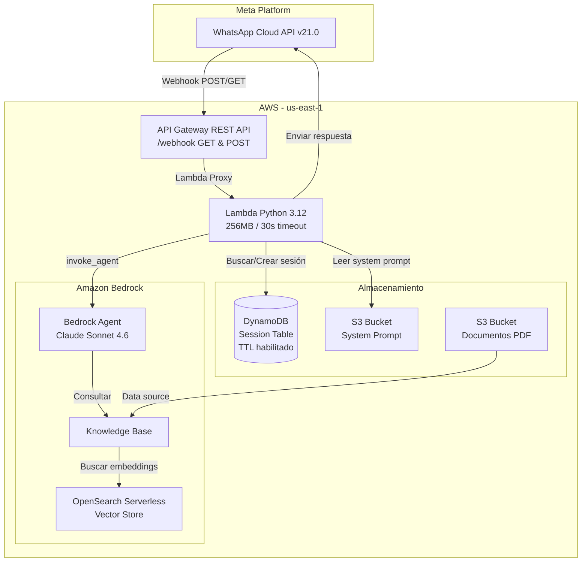
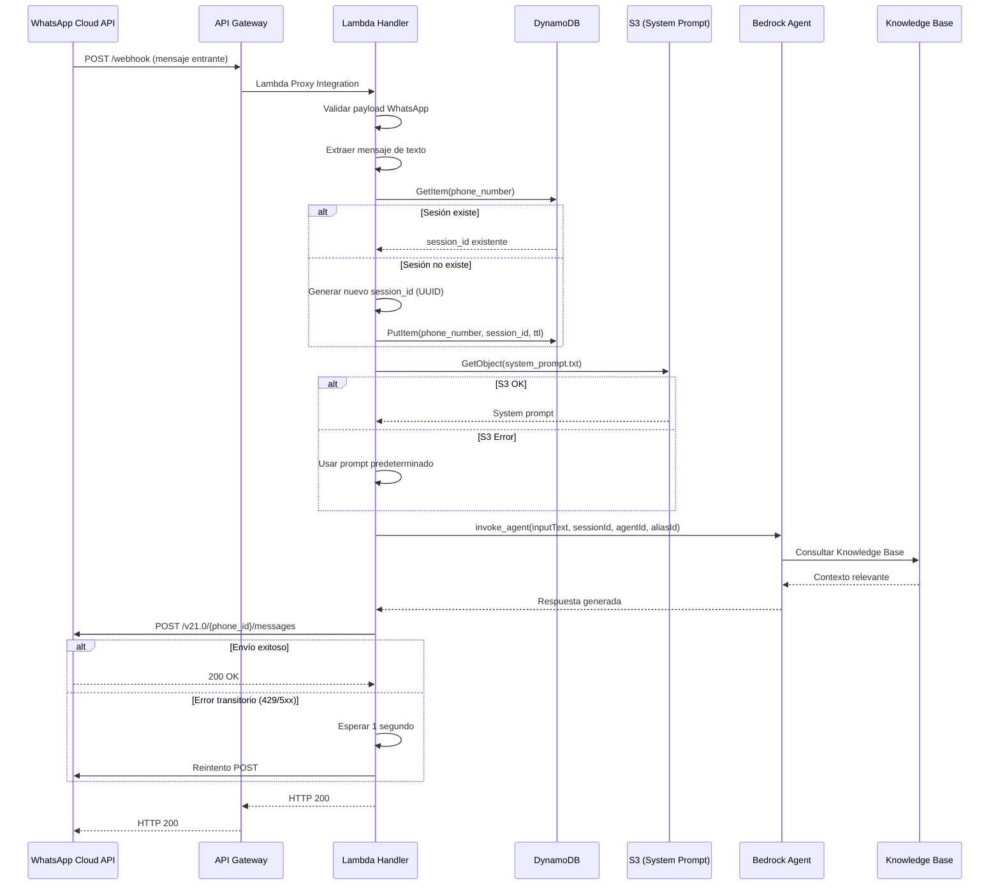

# Documento de Diseño — WABA Bedrock Webhook

## Resumen

Este documento describe el diseño técnico de un sistema serverless que integra la WhatsApp Business API (Cloud API) con Amazon Bedrock Agent respaldado por una Knowledge Base. El sistema recibe mensajes de WhatsApp a través de un webhook (API Gateway + Lambda), los procesa mediante un Bedrock Agent que consulta una base de conocimiento indexada en OpenSearch Serverless, y envía las respuestas de vuelta al usuario vía WhatsApp. Las sesiones de conversación multi-turno se gestionan con DynamoDB, y el system prompt se lee dinámicamente desde S3. Toda la infraestructura se despliega con CDK en TypeScript.

### Decisiones de Diseño Clave

1. **Bedrock Agent (no RetrieveAndGenerate)**: Se usa `invoke_agent` en lugar de `retrieve_and_generate` para aprovechar la orquestación nativa del agente, incluyendo gestión de sesiones integrada y posibilidad de agregar action groups en el futuro.
2. **CDK `@aws-cdk/aws-bedrock-alpha`**: Se utiliza el módulo alpha de CDK para Bedrock que provee constructos L2 para Agent, KnowledgeBase y OpenSearch Serverless, simplificando la configuración de permisos y asociaciones.
3. **DynamoDB para sesiones**: Aunque Bedrock Agent gestiona el contexto de conversación internamente con `sessionId`, se usa DynamoDB para mapear números de teléfono de WhatsApp a session IDs del agente, permitiendo persistencia y TTL automático.
4. **System prompt desde S3**: Permite modificar el comportamiento del agente sin redespliegue, ideal para iteraciones rápidas durante la demo.
5. **Respuesta síncrona**: La Lambda procesa el mensaje y responde dentro del timeout de 30 segundos, respondiendo HTTP 200 a WhatsApp inmediatamente y procesando en el mismo ciclo de ejecución.

---

## Arquitectura

### Diagrama de Arquitectura General



### Flujo de Procesamiento de Mensajes



---

## Componentes e Interfaces

### 1. Lambda Handler (`handler.py`)

Punto de entrada principal que orquesta todo el flujo de procesamiento.

**Responsabilidades:**
- Manejar verificación de webhook (GET)
- Parsear y validar payloads de WhatsApp (POST)
- Orquestar el flujo: sesión → prompt → agente → respuesta
- Manejar errores y logging

**Interfaz:**
```python
def lambda_handler(event: dict, context: LambdaContext) -> dict:
    """
    Handler principal de la Lambda.
    
    Args:
        event: Evento de API Gateway (Lambda Proxy Integration)
        context: Contexto de ejecución Lambda
    
    Returns:
        dict con statusCode, headers y body
    """
```

**Funciones internas:**
```python
def handle_verification(params: dict) -> dict:
    """Maneja solicitudes GET de verificación del webhook."""

def handle_message(body: dict) -> dict:
    """Procesa solicitudes POST con mensajes entrantes."""

def extract_text_messages(body: dict) -> list[dict]:
    """Extrae mensajes de tipo texto del payload de WhatsApp.
    
    Returns:
        Lista de dicts con 'from' (phone), 'text' (contenido), 'id' (message_id)
    """
```

### 2. Cliente de WhatsApp (`whatsapp.py`)

Encapsula la comunicación con la WhatsApp Cloud API v21.0.

**Interfaz:**
```python
class WhatsAppClient:
    def __init__(self, phone_number_id: str, access_token: str):
        """Inicializa el cliente con credenciales de WhatsApp."""
    
    def send_text_message(self, to: str, text: str) -> dict:
        """
        Envía un mensaje de texto a un número de WhatsApp.
        
        Args:
            to: Número de teléfono destinatario
            text: Texto del mensaje
        
        Returns:
            Respuesta de la API de WhatsApp
        
        Raises:
            WhatsAppSendError: Si el envío falla después del reintento
        """
```

**Detalles de implementación:**
- URL base: `https://graph.facebook.com/v21.0/{phone_number_id}/messages`
- Headers: `Authorization: Bearer {access_token}`, `Content-Type: application/json`
- Payload: `{"messaging_product": "whatsapp", "recipient_type": "individual", "to": "{to}", "type": "text", "text": {"body": "{text}"}}`
- Reintento: 1 reintento tras 1 segundo de espera para errores HTTP 429 o 5xx
- Usa `urllib3` (disponible en el runtime de Lambda) para evitar dependencias externas

### 3. Cliente de Bedrock Agent (`bedrock_agent.py`)

Encapsula la invocación del Bedrock Agent.

**Interfaz:**
```python
class BedrockAgentClient:
    def __init__(self, agent_id: str, agent_alias_id: str):
        """Inicializa el cliente con IDs del agente."""
    
    def invoke(self, input_text: str, session_id: str) -> str:
        """
        Invoca el Bedrock Agent con un mensaje y sesión.
        
        Args:
            input_text: Texto del mensaje del usuario
            session_id: Identificador de sesión para contexto multi-turno
        
        Returns:
            Texto de la respuesta del agente
        
        Raises:
            BedrockAgentError: Si la invocación falla o excede timeout
        """
```

**Detalles de implementación:**
- Usa `boto3` client `bedrock-agent-runtime`
- Método: `invoke_agent(agentId, agentAliasId, sessionId, inputText)`
- La respuesta viene como EventStream; se concatenan los chunks de `completion` para obtener el texto final
- Timeout de 25 segundos configurado en el cliente boto3
- El Bedrock Agent gestiona internamente el contexto multi-turno usando el `sessionId`

### 4. Gestor de Sesiones (`session_manager.py`)

Gestiona el mapeo entre números de teléfono de WhatsApp y session IDs del Bedrock Agent.

**Interfaz:**
```python
class SessionManager:
    def __init__(self, table_name: str, ttl_hours: int = 24):
        """Inicializa el gestor con el nombre de la tabla DynamoDB."""
    
    def get_or_create_session(self, phone_number: str) -> str:
        """
        Obtiene el session_id existente o crea uno nuevo.
        
        Args:
            phone_number: Número de teléfono de WhatsApp
        
        Returns:
            session_id (UUID string) para usar con Bedrock Agent
        """
```

**Detalles de implementación:**
- `GetItem` con `phone_number` como clave de partición
- Si existe y no ha expirado, retorna el `session_id` existente
- Si no existe, genera un UUID v4, hace `PutItem` con TTL calculado, y retorna el nuevo `session_id`
- Actualiza el `ttl` y `last_activity` en cada acceso para extender la sesión activa

### 5. Lector de System Prompt (`prompt_reader.py`)

Lee el system prompt desde S3 con fallback a un valor predeterminado.

**Interfaz:**
```python
class PromptReader:
    def __init__(self, bucket: str, key: str):
        """Inicializa con la ubicación del prompt en S3."""
    
    def get_prompt(self) -> str:
        """
        Lee el system prompt desde S3.
        
        Returns:
            Contenido del system prompt (desde S3 o predeterminado)
        """
```

**Detalles de implementación:**
- Usa `boto3` client `s3` con `GetObject`
- Cachea el prompt en memoria durante la vida de la instancia Lambda (warm start)
- Si S3 falla, usa un prompt predeterminado hardcodeado y registra error
- El prompt predeterminado: `"Eres un asistente virtual. Responde las preguntas del usuario basándote en la información disponible en la base de conocimiento."`

### 6. CDK Stack (`lib/stack.ts`)

Stack principal de CDK que define toda la infraestructura.

**Componentes creados:**
- OpenSearch Serverless Collection (VECTORSEARCH)
- S3 Buckets (documentos PDF, system prompt)
- Bedrock Knowledge Base con data source S3
- Bedrock Agent con Knowledge Base asociada
- Bedrock Agent Alias
- DynamoDB Table (sesiones con TTL)
- Lambda Function (Python 3.12)
- API Gateway REST API (/webhook GET + POST)
- Permisos IAM necesarios
- CloudFormation Outputs

---

## Modelos de Datos

### Payload de Webhook Entrante (WhatsApp Cloud API)

```json
{
  "object": "whatsapp_business_account",
  "entry": [
    {
      "id": "WHATSAPP_BUSINESS_ACCOUNT_ID",
      "changes": [
        {
          "value": {
            "messaging_product": "whatsapp",
            "metadata": {
              "display_phone_number": "PHONE_NUMBER",
              "phone_number_id": "PHONE_NUMBER_ID"
            },
            "contacts": [
              {
                "profile": { "name": "USER_NAME" },
                "wa_id": "USER_PHONE_NUMBER"
              }
            ],
            "messages": [
              {
                "from": "USER_PHONE_NUMBER",
                "id": "MESSAGE_ID",
                "timestamp": "TIMESTAMP",
                "type": "text",
                "text": { "body": "MESSAGE_TEXT" }
              }
            ]
          },
          "field": "messages"
        }
      ]
    }
  ]
}
```

### Modelo de Sesión (DynamoDB)

| Atributo | Tipo | Descripción |
|---|---|---|
| `phone_number` | String (PK) | Número de teléfono de WhatsApp del usuario |
| `session_id` | String | UUID v4 del session ID para Bedrock Agent |
| `last_activity` | Number | Timestamp Unix de la última actividad |
| `ttl` | Number | Timestamp Unix de expiración (TTL de DynamoDB) |
| `created_at` | String | Timestamp ISO 8601 de creación de la sesión |

### Payload de Envío de Mensaje (WhatsApp Cloud API)

```json
{
  "messaging_product": "whatsapp",
  "recipient_type": "individual",
  "to": "USER_PHONE_NUMBER",
  "type": "text",
  "text": {
    "body": "RESPONSE_TEXT"
  }
}
```

### Respuesta de invoke_agent (Bedrock Agent Runtime)

```python
# Estructura simplificada de la respuesta
{
    "completion": EventStream([
        {"chunk": {"bytes": b"parte de la respuesta..."}},
        {"chunk": {"bytes": b"continuación..."}}
    ]),
    "contentType": "application/json",
    "sessionId": "session-id-string"
}
```

### Variables de Entorno de la Lambda

| Variable | Descripción | Fuente |
|---|---|---|
| `WHATSAPP_VERIFY_TOKEN` | Token de verificación del webhook | Parámetro CDK |
| `WHATSAPP_ACCESS_TOKEN` | Token de acceso de Meta | Parámetro CDK |
| `WHATSAPP_PHONE_NUMBER_ID` | ID del número de WhatsApp Business | Parámetro CDK |
| `BEDROCK_AGENT_ID` | ID del Bedrock Agent | Generado por CDK |
| `BEDROCK_AGENT_ALIAS_ID` | ID del alias del Bedrock Agent | Generado por CDK |
| `SYSTEM_PROMPT_BUCKET` | Nombre del bucket S3 del prompt | Generado por CDK |
| `SYSTEM_PROMPT_KEY` | Clave del archivo de prompt en S3 | Configurable (default: `system_prompt.txt`) |
| `SESSION_TABLE_NAME` | Nombre de la tabla DynamoDB | Generado por CDK |

### Estructura del Proyecto

```
waba-bedrock-webhook/
├── lambda/
│   ├── handler.py              # Handler principal
│   ├── whatsapp.py             # Cliente WhatsApp Cloud API
│   ├── bedrock_agent.py        # Cliente Bedrock Agent
│   ├── session_manager.py      # Gestor de sesiones DynamoDB
│   ├── prompt_reader.py        # Lector de system prompt S3
│   └── requirements.txt        # Dependencias Python (solo boto3 para dev)
├── infra/
│   ├── bin/app.ts              # Entry point CDK
│   ├── lib/
│   │   └── waba-bedrock-stack.ts  # Stack principal
│   ├── package.json
│   ├── tsconfig.json
│   └── cdk.json
├── tests/
│   ├── unit/
│   │   ├── test_handler.py
│   │   ├── test_whatsapp.py
│   │   ├── test_bedrock_agent.py
│   │   ├── test_session_manager.py
│   │   └── test_prompt_reader.py
│   └── conftest.py
└── README.md
```


---

## Propiedades de Correctitud

*Una propiedad es una característica o comportamiento que debe mantenerse verdadero en todas las ejecuciones válidas de un sistema — esencialmente, una declaración formal sobre lo que el sistema debe hacer. Las propiedades sirven como puente entre especificaciones legibles por humanos y garantías de correctitud verificables por máquinas.*

### Propiedad 1: Correctitud de la verificación del webhook

*Para cualquier* par de tokens (verify_token del request y WHATSAPP_VERIFY_TOKEN del entorno) y cualquier string de challenge, si los tokens coinciden el handler debe retornar HTTP 200 con el challenge como cuerpo; si los tokens no coinciden, el handler debe retornar HTTP 403.

**Valida: Requisitos 1.2, 1.3**

### Propiedad 2: Parámetros de verificación faltantes

*Para cualquier* solicitud GET que omita al menos uno de los parámetros requeridos (`hub.mode`, `hub.verify_token`, `hub.challenge`), el handler debe retornar HTTP 400.

**Valida: Requisitos 1.4**

### Propiedad 3: Extracción y procesamiento individual de mensajes de texto

*Para cualquier* payload válido de WhatsApp que contenga N mensajes de tipo texto (N ≥ 1), la función de extracción debe retornar exactamente N mensajes, cada uno con los campos `from`, `text` e `id` correctos correspondientes al payload original.

**Valida: Requisitos 2.1, 2.2**

### Propiedad 4: Filtrado de mensajes no-texto

*Para cualquier* payload de WhatsApp que contenga únicamente mensajes de tipo no-texto (imagen, audio, video, documento, ubicación), la función de extracción de mensajes de texto debe retornar una lista vacía y el handler debe responder con HTTP 200.

**Valida: Requisitos 2.3**

### Propiedad 5: Manejo graceful de payloads inválidos

*Para cualquier* payload POST que no contenga la estructura esperada de la WhatsApp Cloud API (sin `entry`, sin `changes`, sin `messages`, o con estructura malformada), el handler debe responder con HTTP 200 sin lanzar excepciones.

**Valida: Requisitos 2.5**

### Propiedad 6: Idempotencia y unicidad de sesiones

*Para cualquier* número de teléfono, invocar `get_or_create_session` dos veces consecutivas debe retornar el mismo `session_id`. Además, *para cualquier* par de números de teléfono distintos, los `session_id` generados deben ser diferentes.

**Valida: Requisitos 3.2, 3.3**

### Propiedad 7: Concatenación de chunks de respuesta del agente

*Para cualquier* secuencia de chunks de bytes retornados por el Bedrock Agent, la función de extracción de respuesta debe producir un string que sea la concatenación decodificada (UTF-8) de todos los chunks en orden.

**Valida: Requisitos 4.3**

### Propiedad 8: Construcción correcta del payload de envío de WhatsApp

*Para cualquier* número de teléfono destinatario y texto de respuesta, el payload construido para la WhatsApp Cloud API debe contener `messaging_product` = "whatsapp", `recipient_type` = "individual", `to` = número del destinatario, `type` = "text", y `text.body` = texto de respuesta.

**Valida: Requisitos 5.2**

### Propiedad 9: Reintento en errores transitorios

*Para cualquier* código de estado HTTP retornado por la WhatsApp Cloud API, si el código es 429 o está en el rango 500-599, el cliente debe reintentar exactamente una vez; para cualquier otro código de error (4xx excepto 429), no debe reintentar.

**Valida: Requisitos 5.4**

### Propiedad 10: Logging que preserva privacidad

*Para cualquier* mensaje entrante con contenido de texto arbitrario, los logs generados deben contener el número de teléfono del remitente y el tipo de mensaje, pero nunca deben contener el contenido del texto del mensaje.

**Valida: Requisitos 10.1**

### Propiedad 11: Seguridad ante excepciones no controladas

*Para cualquier* excepción lanzada durante el procesamiento de un mensaje, el handler debe capturarla, registrar el traceback completo en los logs, y retornar HTTP 200.

**Valida: Requisitos 10.4**

---

## Manejo de Errores

### Estrategia General

El sistema sigue el principio de "siempre responder 200 a WhatsApp" para evitar reintentos de la plataforma Meta, manejando errores internamente.

### Tabla de Errores

| Escenario | Acción | Respuesta HTTP |
|---|---|---|
| Token de verificación no coincide | Rechazar solicitud | 403 |
| Parámetros de verificación faltantes | Rechazar solicitud | 400 |
| Payload POST inválido | Log warning, ignorar | 200 |
| Mensaje de tipo no-texto | Ignorar silenciosamente | 200 |
| Error al leer system prompt de S3 | Usar prompt predeterminado, log error | 200 |
| Bedrock Agent timeout (>25s) | Enviar mensaje de error al usuario | 200 |
| Bedrock Agent error | Enviar mensaje de error al usuario | 200 |
| Error al enviar mensaje WhatsApp (transitorio) | Reintentar 1 vez tras 1s | 200 |
| Error al enviar mensaje WhatsApp (permanente) | Log error | 200 |
| DynamoDB error | Log error, intentar continuar sin sesión | 200 |
| Excepción no controlada | Log traceback completo | 200 |

### Mensajes de Error al Usuario

```python
DEFAULT_ERROR_MESSAGE = "Lo siento, no pude procesar tu solicitud en este momento. Por favor, intenta de nuevo más tarde."
```

### Fallback del System Prompt

```python
DEFAULT_SYSTEM_PROMPT = "Eres un asistente virtual. Responde las preguntas del usuario basándote en la información disponible en la base de conocimiento."
```

---

## Estrategia de Testing

### Enfoque Dual de Testing

El proyecto utiliza dos enfoques complementarios:

1. **Tests unitarios (pytest)**: Verifican ejemplos específicos, casos borde y condiciones de error
2. **Tests basados en propiedades (Hypothesis)**: Verifican propiedades universales con entradas generadas aleatoriamente

### Librería de Property-Based Testing

- **Librería**: [Hypothesis](https://hypothesis.readthedocs.io/) para Python
- **Configuración**: Mínimo 100 iteraciones por test de propiedad
- **Tag format**: `Feature: waba-bedrock-webhook, Property {number}: {property_text}`

### Tests Basados en Propiedades

Cada propiedad de correctitud del documento de diseño se implementa como un test de propiedad individual:

| Propiedad | Módulo bajo test | Generadores |
|---|---|---|
| P1: Verificación webhook | `handler.handle_verification` | Tokens aleatorios, challenges aleatorios |
| P2: Params faltantes | `handler.handle_verification` | Subconjuntos de parámetros requeridos |
| P3: Extracción mensajes texto | `handler.extract_text_messages` | Payloads con N mensajes de texto |
| P4: Filtrado no-texto | `handler.extract_text_messages` | Payloads con tipos no-texto |
| P5: Payloads inválidos | `handler.handle_message` | Dicts aleatorios sin estructura WhatsApp |
| P6: Sesiones idempotentes | `session_manager.get_or_create_session` | Números de teléfono aleatorios (mock DynamoDB) |
| P7: Concatenación chunks | `bedrock_agent.extract_response` | Listas de bytes aleatorios |
| P8: Payload envío WhatsApp | `whatsapp.build_message_payload` | Teléfonos y textos aleatorios |
| P9: Reintento transitorios | `whatsapp.send_text_message` | Códigos HTTP aleatorios (mock HTTP) |
| P10: Privacidad en logs | `handler.handle_message` | Mensajes con contenido aleatorio (mock logger) |
| P11: Seguridad excepciones | `handler.lambda_handler` | Excepciones aleatorias inyectadas |

### Tests Unitarios

| Módulo | Tests |
|---|---|
| `handler.py` | Flujo completo GET verificación, flujo completo POST con mensaje, POST con payload vacío |
| `whatsapp.py` | Envío exitoso, error 429 con reintento, error 400 sin reintento |
| `bedrock_agent.py` | Invocación exitosa, timeout, error de servicio |
| `session_manager.py` | Sesión nueva, sesión existente, error DynamoDB |
| `prompt_reader.py` | Lectura exitosa de S3, fallback a prompt predeterminado, caché en warm start |

### Tests de Infraestructura (CDK)

- **Snapshot tests**: Verifican que el template CloudFormation generado coincide con el esperado
- Cubren todos los requisitos 6.x, 7.x, 8.x y 9.x
- Framework: Jest con `@aws-cdk/assertions`

### Estructura de Tests

```
tests/
├── unit/
│   ├── test_handler.py              # Tests unitarios del handler
│   ├── test_whatsapp.py             # Tests unitarios del cliente WhatsApp
│   ├── test_bedrock_agent.py        # Tests unitarios del cliente Bedrock
│   ├── test_session_manager.py      # Tests unitarios del gestor de sesiones
│   ├── test_prompt_reader.py        # Tests unitarios del lector de prompt
│   └── properties/
│       ├── test_verification_props.py    # P1, P2
│       ├── test_message_props.py         # P3, P4, P5
│       ├── test_session_props.py         # P6
│       ├── test_bedrock_props.py         # P7
│       ├── test_whatsapp_props.py        # P8, P9
│       └── test_logging_props.py         # P10, P11
├── infra/
│   └── test_stack.test.ts           # Snapshot tests CDK
└── conftest.py                      # Fixtures compartidos (mocks)
```

### Dependencias de Testing

```
# tests/requirements-test.txt
pytest>=7.0
hypothesis>=6.0
moto>=5.0          # Mocks de AWS (DynamoDB, S3)
pytest-mock>=3.0
```
